## 传输协议

### TCP/IP协议

#### TCP/IP协议的分层管理

1. 应用层:决定了向用户提供应用服务时通信的活动
2. 传输层:传输层对上层应用层提供处于网络连接中的两台计算机之间的数据传输
3. 网络层:用于出路网络上流动的数据包
4. 链路层:用来出路网络的硬件部分

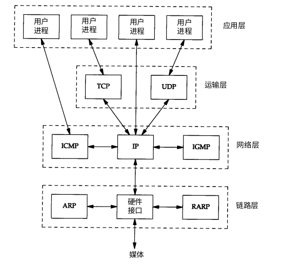

#### TCP/IP的封装过程

当应用程序用 T C P传送数据时,数据被送入协议栈中,然后逐个通过每一层直到被当作一串比特流送入网络。其中每一层对收到的数据都要增加一些首部信息(有时还要增加尾部信息)。T C P传给 I P的数据单元称作 T C P报文段或简称为 T C P段(T C Psegment)。I P传给网络接口层的数据单元称作 I P数据报(IP datagram)。通过以太网传输的比特流称作帧(Frame)。

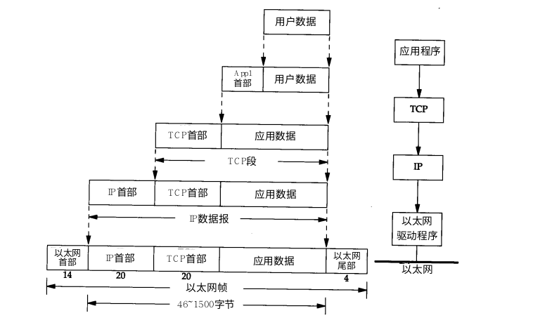

UDP的数据封装过程与TCP的封装过程相似

#### TCP/IP的分用过程

当目的主机收到一个以太网数据帧时,数据就开始从协议栈中由底向上升,同时去掉各层协议加上的报文首部。每层协议盒都要去检查报文首部中的协议标识,以确定接收数据的上层协议。这个过程称作分用(Demultiplexing)。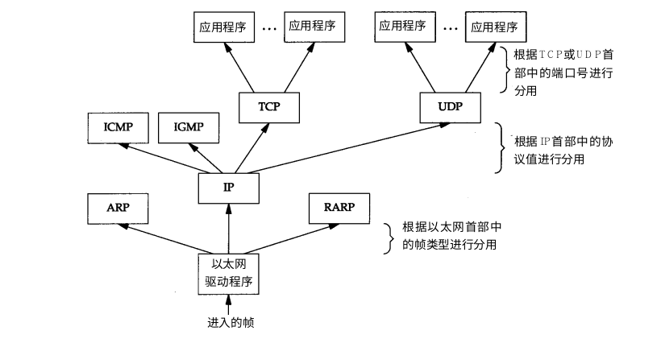

### UDP协议

#### UDP的特点

1. 面向数据报传输
2. 是一种不可靠的传输协议
3. 每次操作产生一个包,数据没有确认,没有回话建立的过程

#### UDP的首部

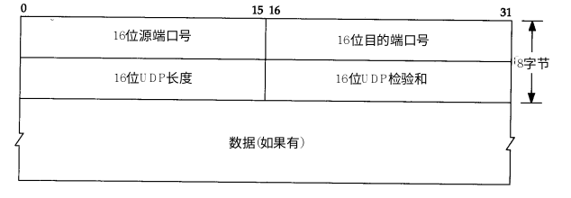

UDP的首部的各字段如图所示

端口号表示发送进程和接收进程。在图 1 - 8中,我们画出了 T C P和U D P用目的端口号来分用来自I P层的数据的过程。由于 I P层已经把I P数据报分配给 T C P或U D P(根据I P首部中协议字段值),因此T C P端口号由 T C P来查看,而 U D P端口号由 U D P来查看。 T C P端口号与 U D P端口号是相互独立的。

#### UDP校验和的计算

UDP校验和的计算分为三个部分:伪首部,首部,数据

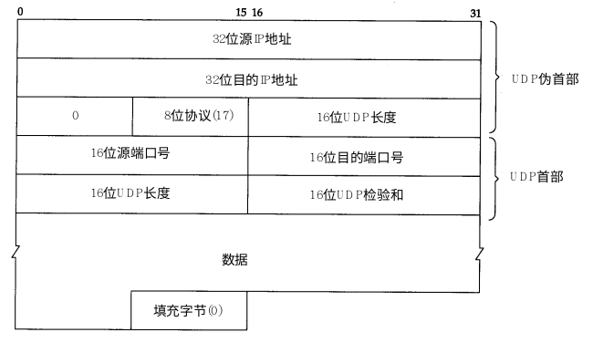

#### UDP中存在的IP分片

1. IP把MTU与数据的长度进行比较
2. 如果需要则进行分片,分片可发生在原始主机也可发生在中间路由器
3. 只有到达目的地才进行重组装
4. 重组装咋目的地IP层完成,分片与重组过程对TCP与UDP是透明的

#### 分片的注意点

1. 分片后,每片都有自己的IP头部
2. 丢一片就需要全部重传
3. 片偏移需要被8整除

### TCP协议

TCP协议是一种对传输,发送,通信都进行控制的协议

* 丢包-->重发控制
* 乱序-->顺序控制

#### TCP协议的特点

1. 面向连接的协议
2. 是一种可靠的协议
3. 三次握手建立连接,四次挥手结束

#### TCP协议建立与结束的图解过程

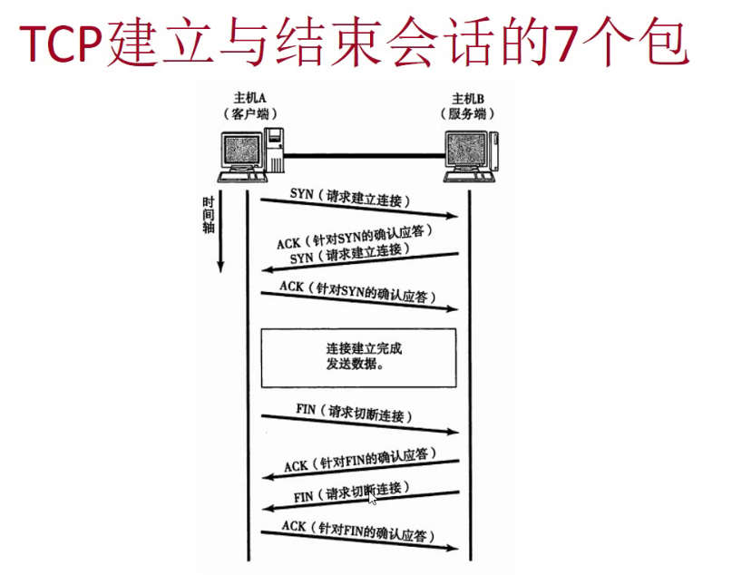

#### 注意点

1. 序列号是对每个字节的编号
2. ACK对应的是下一个SYN开始的序列号
3. 序列号的初始值是由算法决定的,不是从1开始的
4. 两个方向的序列号相互独立

#### TCP协议的首部

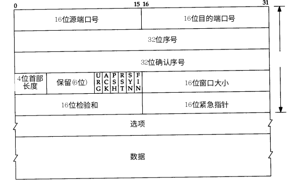

#### TCP协议中的滑动窗口技术

发送段主机在发送了一个段之后,不必要一直等待确认应答后才能继续发送的技术

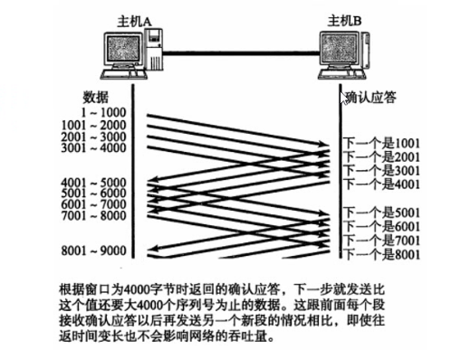

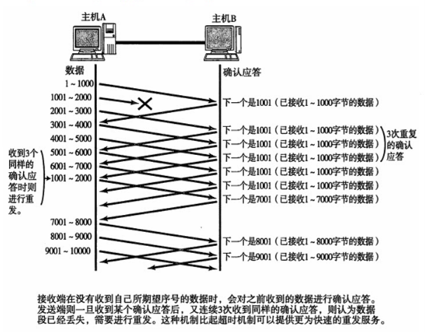

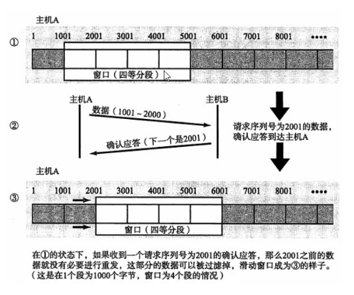

在窗口内的数据,即便没有收到确认应答也可以继续发送。此外，从该窗口中能看到的数据因其某种数据已在传输中丢失，所以发送端无法收到确认应答，这种情况也需要进行重发。为此，发送端主机咋等到确认应答返回之前，必须在缓冲区中保留这部分数据。

在滑动窗口以外的部分包括尚未发送的数据以及已经确认对端已收到的数据。当数据发出后若如期收到确认应答就可以不用再进行重发，此时数据可以从缓存区清楚。

收到确认应答的情况下，将窗口滑动到确认应答中的序列号的位置。这样可以顺序地将多个段同时发送提高通信性能。这种机制也被

滑动窗口控制

### HTTP协议

超文本传输协议

#### HTTP协议的四个特点

1. 客户端与服务器请求、相应模型
2. 无状态协议
3. 顺势协议（1.0为典型）
4. 哑服务

#### 请求与响应的交换通信方式

请求必定由客服端发出，而服务器端回复响应

#### 请求的报文构成

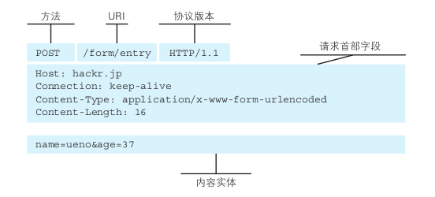

首部字段中的Host是必须的

空行的作用是区别开主题与首部的内容

#### 响应的报文构成

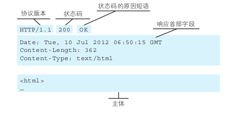

#### HTTP的无状态特性

为了更快地处理大量事物,HTTP协议自身不对请求和响应之间的通信状态进行保存,可以用Cookie技术进行保存

#### HTTP的get和post方法

###### get

get方法用来请求访问已被URI识别的资源。制定的资源经服务器端解析后返回响应内容。也就是说,如果请求的资源是文本,那就保持原样返回;如果是像 CGI(Common Gateway Interface,通用网关接口)那样的程序,则返回经过执行后的输出结果。

###### post

POST 方法用来传输实体的主体。
虽然用GET方法也可以传输实体的主体,但一般不用GET方法进行传输, 而是用POST方法。虽说POST的功能与GET很相似, 但POST 的主要目的并不是获取响应的主体内容。

get VS post

### Socket

#### 什么是socket套嵌字

Socket是应用层与TCP/IP协议族通信的中间软件抽象层，**它是一组接口**。在设计模式中，Socket其实就是一个门面模式，它把复杂的TCP/IP协议族隐藏在Socket接口后面，对用户来说，一组简单的接口就是全部，让Socket去组织数据，以符合指定的协议。

#### Socket的分类

**套接字分为三类：**

1. 流式socket（SOCK_STREAM）：流式套接字提供可靠、面向连接的通信流；它使用TCP协议，从而保证了数据传输的正确性和顺序性。

2. 数据报socket（SOCK_DGRAM）：数据报套接字定义了一种无连接的服务，数据通过相互独立的保温进行传输，是无序的，并且不保证是可靠、无差错的。它使用的数据报协议是UDP。

3. 原始socket：原始套接字允许对底层协议如IP或ICMP进行直接访问，它功能强大但使用复杂，主要用于一些协议的开发。

**套接字由三个参数构成：IP地址，端口号，传输层协议。**这三个参数用以区分不同应用程序进程间的网络通信与连接。