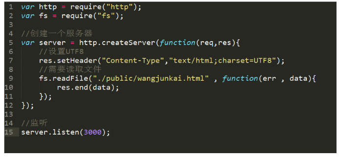
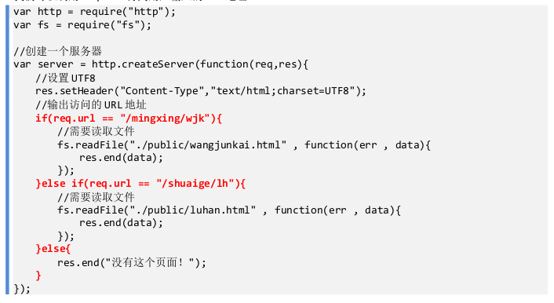
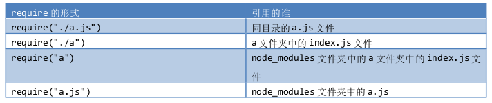

## Node.js的学习

### node.js的起源

Rayn Dahl 发现:以老牌 PHP 为例,理论上一个 8GB 内存的服务器可以同时连接的最大用户数为 4000 个
左右。要让 Web 应用程序支持更多的用户,就需要增加服务器的数量,而 Web 应用程序的硬件成本当然就上升
了。
这个哥们就立志要发明一个平台,比 PHP 、 JSP 要有更高的性能、并发性。
他将 Chrome 浏览器的 V8 引擎(目前世界上最快的 JS 解析引擎)移植到了服务器上,开发出了 Node.js
平台。
2009 年底, Ryan Dahl 在柏林举行的 JSConf EU 会议上发表关于 Node.js 的演讲,之后 Node.js 逐渐流
行于世。
Node.js 是 一 个 平 台 不 是 一 个 语 言 , 语 言 仍 然 是 JavaScript 。 此 时 Node.js 平 台 可 以 让 我 们 用
JavaScript 语言来开发服务器程序。

### node.js最简单的Demo

利用node.js的http模块实现请求与输出

res.write可以多条输出

但必须要以res.end作为结尾

在write\end中可写html代码

### node.js对外置页面的引用

配合fs使用,使得页面得以方便得呈现

### node.js的路由

我们可以利用 req.url 得到用户输入的 URL 地址。

* 物理文件的层次和 URL 是没有关系的!
* Node.js 可以做顶层路由设计!一个页面想叫什么 URL 就可以叫做什么 URL !
* 用户输入的 URL 可以被路由映射为任何 HTML 页面!

### node.js的模块

HTML 宿主环境中,多个 js 文件共用一个 html 宿主,所以它们之间的作用域是打通的。

###### 使用exports.** = **的语法可以进行暴露

暴露的时候要注意两点:

1 建议:暴露的时候必须是 exports.** = ** , ** 必须一致。你别玩杂技。
明明变量是 m 你非要用 n 暴露。

2 建议:接受的时候,文件名是什么,就用什么接收。你别玩杂技。

###### 使用 module.exports = ** 暴露

当一个 js 文件中仅仅希望暴露一个东西(通常是构造函数),此时我们可以使用 module.exports = ** 的方
法暴露。

### node.js中require的形式

